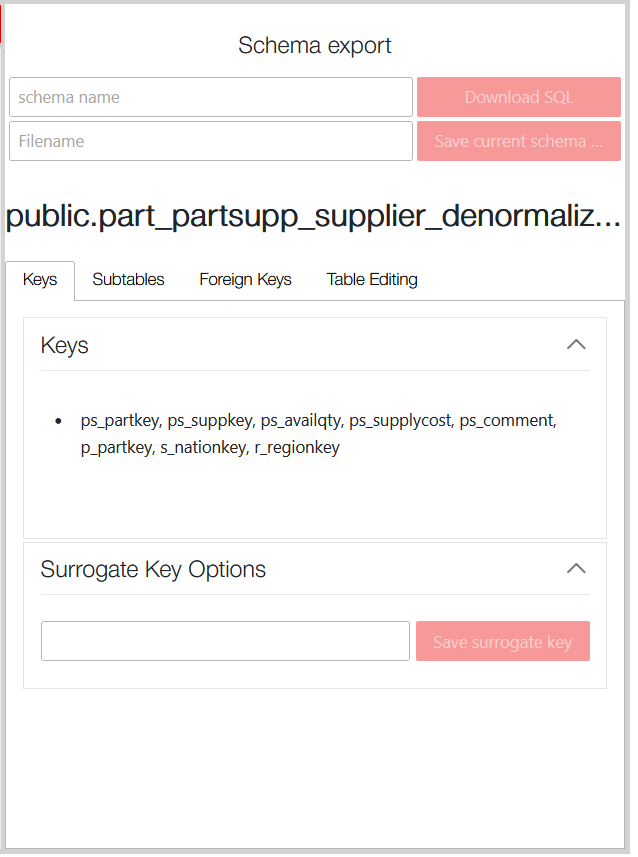

# Side Bar  

The side bar offers many different options to transform your schema.  
At the top of the side bar, you have the option to export the transformations you have made as SQL code, in order to run it on your database and persist it.  
Beneath that, you can save the current state of the program into a zip archive which you can later load from the [home](../start_page/home.md) page.  
At the bottom part of the sidebar there is a menu with five tabs:  

1. Keys  

The user sees all valid keys for a table in the ***Keys*** menu.  
Below, you can create a ***surrogate key***, meaning an artificial primary key, for the selected table.

2. Subtables  

The user sees all attributes that can be extracted to another table with the potential primary keys in the drop down. The calculated functional dependencies are used for that. You can also filter for attributes.  
The user also has the option to check if a certain functional dependency is valid and/or if there are tuples in the database that violate this functional dependency.  

3. Foreign Keys  

In the menu option ***Possible Foreign Keys*** the user can create a foreign key, based on the metanome results of found inclusion dependencies.  
The option ***Suggest Foreign Key*** allows the user to check if a foreign key can be created between two tables or if there are violating tuples in the database.  
***Dismissed Foreign Keys*** lists all foreign keys that are not displayed in the canvas at the moment (depends on the mode you're in, see [modes](../schema_editing_page.md)).  
Joins can then be done using the ***J*** button in the middle of the arrows displayed in the schema graph.  

4. Table Editing  

Here the user can rename the table or rename or delete columns.  

5. Union  

The user can select a table to union with and use a drag-and-drop menu to match columns.  
